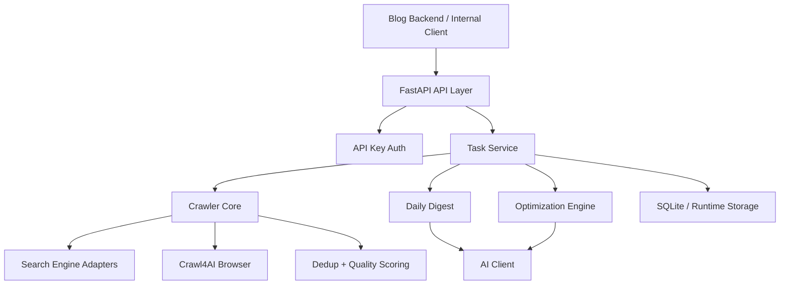
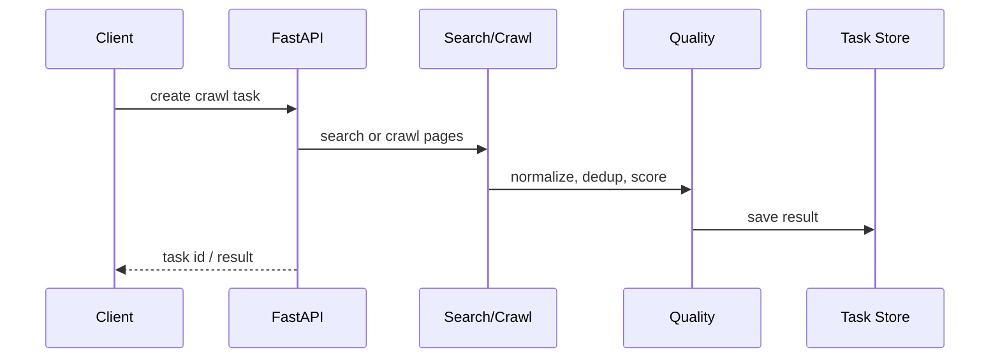
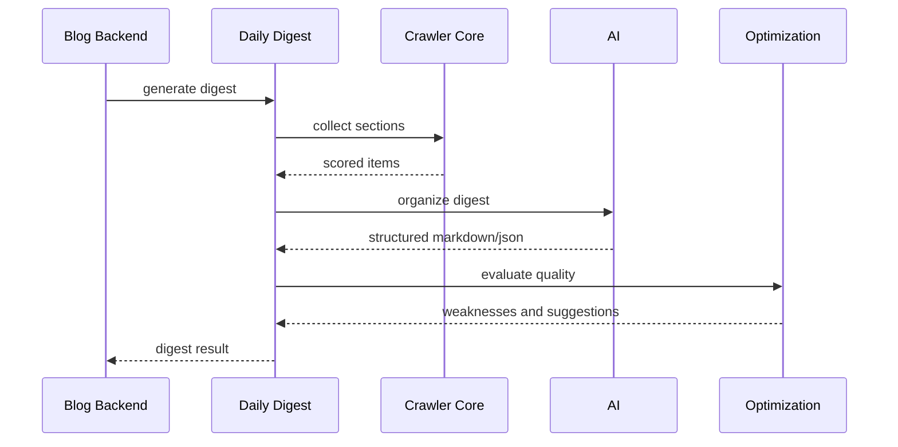

# Crawler Service Architecture v3

> 更新时间：2026-06-03
> 当前状态：MVP Beta 可试用
> 定位：独立 HTTP 信息采集与日报生成服务，可供博客系统和少量内部服务调用。

---

## 设计目标

Crawler Service 的目标不是做一个重型爬虫平台，而是在个人博客和少量内部服务场景下，提供稳定、可配置、可降级的信息采集能力。

核心目标：

- 提供独立 HTTP API，不重度绑定博客系统。
- 支持单页抓取、深度抓取、关键词搜索、日报生成、自动优化评估。
- 外部搜索源或网页结构变化时，尽量降级而不是整体不可用。
- 让日报系统可以持续提升内容质量。
- MVP 阶段最多支持两个内部调用方，不做复杂多租户。

---

## 架构总览



## 模块职责

| 模块 | 职责 |
|------|------|
| API Layer | 暴露 health、crawl、task、digest、optimization、config API |
| Auth | 可选 API Key 鉴权，支持 `X-Client-Id` 区分调用方 |
| Task Service | 创建任务、查询状态、保存结果、处理失败 |
| Crawler Core | 单页抓取、深度抓取、关键词搜索、搜索引擎 fallback |
| Dedup | URL、标题、内容指纹去重 |
| Quality | 来源可信度、内容结构、营销/广告特征评分 |
| Daily Digest | 多章节日报采集、组织、生成和质量评估 |
| Optimization | 记录质量趋势，生成弱点建议和下一轮策略建议 |
| Config Sync | 从环境变量、本地配置或博客后端同步配置 |

---

## API 能力

典型接口：

- `GET /health`
- `POST /crawl`
- `POST /crawl/search`
- `POST /crawl/deep`
- `POST /digest/generate`
- `GET /digest/{task_id}`
- `POST /optimization/evaluate`
- `GET /optimization/history`
- `POST /config/refresh`

调用方建议携带：

```http
X-API-Key: <crawler-api-key>
X-Client-Id: blog-backend
```

MVP 阶段 `X-Client-Id` 主要用于日志、排查和简单隔离，不做复杂租户级权限模型。

---

## 数据流

### 普通采集



### 日报生成



---

## 配置策略

配置来源优先级：

1. 请求级参数。
2. 博客后端 `sys_config` 同步。
3. Crawler 本地配置文件。
4. 环境变量。
5. 内置默认值。

关键配置：

- `CRAWLER_API_KEY`
- `CRAWLER_AUTH_ENABLED`
- `CRAWLER_ALLOWED_CLIENTS`
- `CRAWLER_DEPENDENCY_MODE`
- `CRAWLER_SEARCH_ENGINES`
- `CRAWLER_TIMEOUT_SECONDS`
- `AI_BASE_URL`
- `AI_API_KEY`
- `AI_MODEL`
- `DAILY_DIGEST_ENABLED`
- `DAILY_DIGEST_SECTIONS`
- `OPTIMIZATION_ENABLED`

## 依赖模式

`CRAWLER_DEPENDENCY_MODE` 用于降低外部变化风险：

| 模式 | 说明 |
|------|------|
| `balanced` | 默认模式，搜索源和直接抓取混合使用 |
| `search_first` | 优先搜索引擎，适合信息发现 |
| `direct_first` | 优先指定 URL/RSS，适合稳定来源 |
| `fallback_only` | 外部依赖异常时保底，尽量返回已有或低成本结果 |

---

## 质量控制

Crawler 输出结果进入日报前，需要经过：

- URL normalization。
- 同源重复控制。
- 标题相似度过滤。
- 内容指纹过滤。
- 来源可信度评分。
- 内容结构评分。
- 广告/营销/下载页倾向惩罚。
- 最终 `pass/review/reject` 判定。

日报系统只应优先使用 `pass`，必要时少量使用 `review`，默认不使用 `reject`。

---

## 当前限制

- 外部网页反爬、搜索引擎页面变化仍可能影响采集质量。
- 自动优化已能记录建议，但强策略反馈仍需增强。
- 暂不支持复杂多租户、计费、配额系统。
- 暂不承诺高并发爬虫平台能力。

## 验证命令

```bash
cd crawler-service
python -m pytest -q --tb=short
```

配合后端和前端：

```bash
mvn test
cd frontend && npm run build
```

## 参考文档

- `../README.md`
- `../../docs/digest-system.md`
- `../../docs/web-collector-module-design.md`
- `../../docs/future-development-plan.md`
